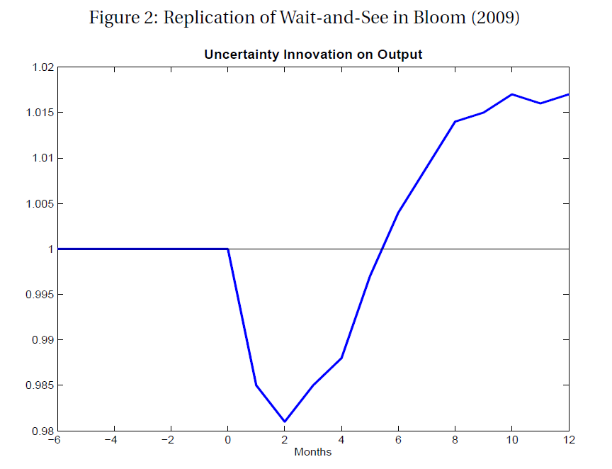

# Business Sentiment

## Business Sentiment
Confidence: 

- Perceptions of the current and expected future business climate.

Uncertainty:

- Agents' inability to forecast the probability of future events occurring.
- Lack of knowledge of the set of possible outcomes and the probability of each occurring.

Global financial crisis & Great Recession 

- associated with low levels of confidence and heightened uncertainty. 

```{r readdata, echo=FALSE, results='hide', message=FALSE, warning=FALSE, cache = TRUE}
setwd("C:\\Users\\Laurie\\OneDrive\\Documents\\BING\\BER Confidence Surveys\\Sentiment")

suppressMessages(library(ggplot2))
suppressMessages(library(plyr))
suppressMessages(library(dplyr))
suppressMessages(library(reshape2))
suppressMessages(library(stargazer))
suppressMessages(library(xtable))
suppressMessages(library(scales))
suppressMessages(library(quantmod))
suppressMessages(library(vars))
suppressMessages(library(tseries))
suppressMessages(library(urca))

GDPdata <- read.csv("GDP Data.csv", header=TRUE, sep=",",na.strings = "", skipNul = TRUE)
GDPdata$X <- as.Date(GDPdata$X, format = "%Y/%m/%d")

##For Grpahing Business cycles
recessions.df = read.table(textConnection(
    "Peak, Trough
    1989-02-28, 1993-05-30
    1996-11-30, 1999-08-31
    2007-11-30, 2009-08-31"), sep=',',
    colClasses=c('Date', 'Date'), header=TRUE)
```

## Confidence
Measurement:

- Qualitative surveys
- Current vs. forward-looking

Relationship:

- Animal spirits view vs. information/news view
- Useful as coincident/leading indicators
- Useful for now-casting and forecasting

## Uncertainty
Measurement:

- volatility in the stock market, bond yields or exchange rates
- dispersion of professional forecasts
- references to "uncertainty" in the media
- dispersion of responses from qualitative forecasts

Relationship:

- Wait-and-see effect
- other channels
- generally has anti-cyclical relationship

# Data

## BER Business Tendency Surveys
Questionnaires  completed by senior executives 

Qualitative - *Up*, *The Same*, or *Down*      

1,000 firms in manufacturing & services sectors 

1,400 firms in construction & trade sectors (retail, wholesale and motor vehicles)

Around 1,000 obs each quarter = 106,274 obs      

Panel sample: partly fixed & partly rotating     

Advantages:

- Ask the relevant agents
- Available long before official stats
- limited revision (little seasonality)   


# Indicators

## RMB/BER Business Confidence Index
leading indicator for SA business cycle 

used by SARB as a component of the official composite leading indicator series 

Constructed from a specific question that appears in all of the surveys: 

(Q1): *"Are prevailing business conditions: Satisfactory, Unsatisfactory?"* 

Weighted percentage of respondents that rated prevailing business conditions as *"Satisfactory"* in a particular sector.

Current conditions or "Activity"

## Confidence Indicators

Derived from the same questions that are present in all surveys

Current and forward-looking:

(Q2A): *"[Development in current quarter] Compared with the same quarter of a year ago, are General Business Conditions: Better, the Same, or Poorer?"*

(Q2P): *"[Development in next quarter] Compared with the same quarter of a year ago, will General Business Conditions be: Better, the Same, or Poorer?"* 

Cross sectional average of survey responses:
$$CC.Confidence_t = Frac_t(Up) - Frac_t(Down)$$ 
$$FL.Confidence_t = Frac_{t+1}(Up) - Frac_{t+1}(Down)$$

For each sector the responses are weighted by firm size and subsector weight

Sectoral indicators weighted by GDP share to form aggregate indicators

```{r manufacturing.conf, echo=FALSE, results='hide', message=FALSE, warning=FALSE, cache = TRUE}
##====================================##
## READING IN THE DATA: MANUFACTURING ##
##====================================##
BER.M <- rbind.fill(read.csv("Manufacturing.csv", header=TRUE, sep=",",na.strings = "", skipNul = TRUE),
                     read.csv("Manufacturing_pre2001.csv", header=TRUE, sep=",",na.strings = "", skipNul = TRUE))
BER.M <- BER.M[,1:62]
colnames(BER.M)[1:7] <- c("region","id","sector","weight","turnover","factor","surveyQ")

BER.M$surveyQ <- toupper(BER.M$surveyQ)
BER.M[nrow(BER.M)+1,1:6] <- BER.M[nrow(BER.M),1:6] 
BER.M[nrow(BER.M),"surveyQ"] <- "2005Q4" 
BER.M[nrow(BER.M)+1,1:6] <- BER.M[nrow(BER.M),1:6] 
BER.M[nrow(BER.M),"surveyQ"] <- "1997Q4" 
BER.M[nrow(BER.M)+1,1:6] <- BER.M[nrow(BER.M),1:6] 
BER.M[nrow(BER.M),"surveyQ"] <- "2000Q1" 

BER.M$region <- factor(BER.M$region)
BER.M$sector <- factor(BER.M$sector) #could include labels
BER.M$id <- factor(BER.M$id)
BER.M$surveyQ <- factor(BER.M$surveyQ)

# replace 1,2,3 (Up, Same, Down) responses with 1,0,-1
for(i in 8:62) {
    BER.M[,i] <- replace(BER.M[,i], BER.M[,i]==2, 0)
    BER.M[,i] <- replace(BER.M[,i], BER.M[,i]==3,-1)
}
BER.M$Q19 <- replace(BER.M$Q19, BER.M$Q19==0,-1) # replace 0 (No) responses with -1
BER.M$Q20 <- replace(BER.M$Q20, BER.M$Q20==0,-1) # replace 0 (Unsatisfactory) with -1

##=====================================##
## CALCULATE INDICATORS: MANUFACTURING ##
##=====================================##
indicators.M <- aggregate(BER.M$Q20, by=list(BER.M$surveyQ), FUN=mean, na.rm=TRUE)
colnames(indicators.M) <- c("Date","Conf_cc")
indicators.M <- cbind(indicators.M, Conf_fl = aggregate(BER.M$Q31, by=list(BER.M$surveyQ), FUN=mean, na.rm=TRUE)[,2])
indicators.M <- cbind(indicators.M, Act_prod = aggregate(BER.M$Q3A, by=list(BER.M$surveyQ), FUN=mean, na.rm=TRUE)[,2])
indicators.M <- cbind(indicators.M, Conf_prod = aggregate(BER.M$Q3P, by=list(BER.M$surveyQ), FUN=mean, na.rm=TRUE)[,2])
indicators.M <- cbind(indicators.M, Act_GBC = aggregate(BER.M$Q7A, by=list(BER.M$surveyQ), FUN=mean, na.rm=TRUE)[,2])
indicators.M <- cbind(indicators.M, Conf_GBC = aggregate(BER.M$Q7P, by=list(BER.M$surveyQ), FUN=mean, na.rm=TRUE)[,2])
indicators.M <- cbind(indicators.M, Invest = aggregate(BER.M$Q10A, by=list(BER.M$surveyQ), FUN=mean, na.rm=TRUE)[,2])
indicators.M <- cbind(indicators.M, Empl = aggregate(BER.M$Q8A, by=list(BER.M$surveyQ), FUN=mean, na.rm=TRUE)[,2])

altBER <- BER.M
altBER$Q8A <- replace(altBER$Q8A, altBER$Q8A==-1,1) # replace -1 (Down) responses with 1
indicators.M <- cbind(indicators.M, Empl_turn = aggregate(altBER$Q8A, by=list(altBER$surveyQ), FUN=mean, na.rm=TRUE)[,2])

##Weighted versions---------------------------------------------------------------------------------
w.Conf_cc <- NULL
w.Conf_fl <- NULL
w.Act_prod <- NULL
w.Conf_prod <- NULL
w.Act_GBC <- NULL
w.Conf_GBC <- NULL
w.Invest <- NULL
w.Empl <- NULL
i <- 0
for(kwartaal in levels(BER.M$surveyQ)) {
    i <- i+1
    temp <- subset(BER.M,BER.M$surveyQ==kwartaal)
    w.Conf_cc[i] <- sum(temp$Q20*temp$factor, na.rm=TRUE)/sum(temp$factor[!is.na(temp$Q20)], na.rm=TRUE)
    w.Conf_fl[i] <- sum(temp$Q31*temp$factor, na.rm=TRUE)/sum(temp$factor[!is.na(temp$Q31)], na.rm=TRUE)
    w.Act_prod[i] <- sum(temp$Q3A*temp$factor, na.rm=TRUE)/sum(temp$factor[!is.na(temp$Q3A)], na.rm=TRUE)
    w.Conf_prod[i] <- sum(temp$Q3P*temp$factor, na.rm=TRUE)/sum(temp$factor[!is.na(temp$Q3P)], na.rm=TRUE)
    w.Act_GBC[i] <- sum(temp$Q7A*temp$factor, na.rm=TRUE)/sum(temp$factor[!is.na(temp$Q7A)], na.rm=TRUE)
    w.Conf_GBC[i] <- sum(temp$Q7P*temp$factor, na.rm=TRUE)/sum(temp$factor[!is.na(temp$Q7P)], na.rm=TRUE)
    w.Invest[i] <- sum(temp$Q10A*temp$factor, na.rm=TRUE)/sum(temp$factor[!is.na(temp$Q10A)], na.rm=TRUE)
    w.Empl[i] <- sum(temp$Q8A*temp$factor, na.rm=TRUE)/sum(temp$factor[!is.na(temp$Q8A)], na.rm=TRUE)
}
w.indicators.M <- as.data.frame(cbind(w.Conf_cc,w.Conf_fl,w.Act_prod,w.Conf_prod,w.Act_GBC,w.Conf_GBC,w.Invest,w.Empl))
w.indicators.M <- cbind(Date=levels(BER.M$surveyQ),w.indicators.M)
```

```{r building.conf, echo=FALSE, results='hide', message=FALSE, warning=FALSE, cache = TRUE}
##===============================##
## READING IN THE DATA: BUILDING ##
##===============================##
#BER.B1 <- read.csv("Building.csv", header=TRUE, sep=";",na.strings = "", skipNul = TRUE)
#BER.B2 <- read.csv("Building_pre2001.csv", header=TRUE, sep=",",na.strings = "", skipNul = TRUE)
BER.B <- rbind.fill(read.csv("Building.csv", header=TRUE, sep=",",na.strings = "", skipNul = TRUE),
                    read.csv("Building_pre2001.csv", header=TRUE, sep=",",na.strings = "", skipNul = TRUE))
BER.B <- BER.B[,1:22]
colnames(BER.B)[1:6] <- c("region","id","sector","weight","factor","surveyQ")

BER.B$surveyQ <- toupper(BER.B$surveyQ)
BER.B[nrow(BER.B)+1,1:5] <- BER.B[nrow(BER.B),1:5] 
BER.B[nrow(BER.B),"surveyQ"] <- "2005Q4" 
BER.B[nrow(BER.B)+1,1:5] <- BER.B[nrow(BER.B),1:5] 
BER.B[nrow(BER.B),"surveyQ"] <- "1998Q3" 
BER.B[nrow(BER.B)+1,1:5] <- BER.B[nrow(BER.B),1:5] 
BER.B[nrow(BER.B),"surveyQ"] <- "1993Q4" 
BER.B[nrow(BER.B)+1,1:5] <- BER.B[nrow(BER.B),1:5] 
BER.B[nrow(BER.B),"surveyQ"] <- "2000Q2" 

BER.B$region <- factor(BER.B$region)
BER.B$sector <- factor(BER.B$sector) #could include labels
BER.B$id <- factor(BER.B$id)
BER.B$surveyQ <- factor(BER.B$surveyQ)
#BER.B$surveyQ <- factor(BER.B$surveyQ, levels=c(levels(BER.B$surveyQ),"05Q4"))

# replace 1,2,3 (Up, Same, Down) responses with 1,0,-1
for(i in 7:22) {
    BER.B[,i] <- replace(BER.B[,i], BER.B[,i]==2, 0)
    BER.B[,i] <- replace(BER.B[,i], BER.B[,i]==3,-1)
}
BER.B$Q1 <- replace(BER.B$Q1, BER.B$Q1==0,-1) # replace 0 (Unsatisfactory) responses with -1

##================================##
## CALCULATE INDICATORS: BUILDING ##
##================================##
indicators.B <- aggregate(BER.B$Q1, by=list(BER.B$surveyQ), FUN=mean, na.rm=TRUE)
colnames(indicators.B) <- c("Date","Conf_cc")
indicators.B <- cbind(indicators.B, Act_prod = aggregate(BER.B$Q3A, by=list(BER.B$surveyQ), FUN=mean, na.rm=TRUE)[,2])
indicators.B <- cbind(indicators.B, Conf_prod = aggregate(BER.B$Q3P, by=list(BER.B$surveyQ), FUN=mean, na.rm=TRUE)[,2])
indicators.B <- cbind(indicators.B, Act_GBC = aggregate(BER.B$Q2A, by=list(BER.B$surveyQ), FUN=mean, na.rm=TRUE)[,2])
indicators.B <- cbind(indicators.B, Conf_GBC = aggregate(BER.B$Q2P, by=list(BER.B$surveyQ), FUN=mean, na.rm=TRUE)[,2])
indicators.B <- cbind(indicators.B, Empl = aggregate(BER.B$Q4A, by=list(BER.B$surveyQ), FUN=mean, na.rm=TRUE)[,2])

altBER <- BER.B
altBER$Q4A <- replace(altBER$Q4A, altBER$Q4A==-1,1) # replace -1 (Down) responses with 1
indicators.B <- cbind(indicators.B, Empl_turn = aggregate(altBER$Q4A, by=list(altBER$surveyQ), FUN=mean, na.rm=TRUE)[,2])

##Weighted versions-----------------------------------------------------------------------------------
w.Conf_cc <- NULL
w.Act_prod <- NULL
w.Conf_prod <- NULL
w.Act_GBC <- NULL
w.Conf_GBC <- NULL
w.Empl <- NULL
i <- 0
for(kwartaal in levels(BER.B$surveyQ)) {
    i <- i+1
    temp <- subset(BER.B,BER.B$surveyQ==kwartaal)
    w.Conf_cc[i] <- sum(temp$Q1*temp$factor, na.rm=TRUE)/sum(temp$factor[!is.na(temp$Q1)], na.rm=TRUE)
    w.Act_prod[i] <- sum(temp$Q3A*temp$factor, na.rm=TRUE)/sum(temp$factor[!is.na(temp$Q3A)], na.rm=TRUE)
    w.Conf_prod[i] <- sum(temp$Q3P*temp$factor, na.rm=TRUE)/sum(temp$factor[!is.na(temp$Q3P)], na.rm=TRUE)
    w.Act_GBC[i] <- sum(temp$Q2A*temp$factor, na.rm=TRUE)/sum(temp$factor[!is.na(temp$Q2A)], na.rm=TRUE)
    w.Conf_GBC[i] <- sum(temp$Q2P*temp$factor, na.rm=TRUE)/sum(temp$factor[!is.na(temp$Q2P)], na.rm=TRUE)
    w.Empl[i] <- sum(temp$Q4A*temp$factor, na.rm=TRUE)/sum(temp$factor[!is.na(temp$Q4A)], na.rm=TRUE)
}
w.indicators.B <- as.data.frame(cbind(w.Conf_cc,w.Act_prod,w.Conf_prod,w.Act_GBC,w.Conf_GBC,w.Empl))
w.indicators.B <- cbind(Date=levels(BER.B$surveyQ),w.indicators.B)
```

```{r trade.conf, echo=FALSE, results='hide', message=FALSE, warning=FALSE, cache = TRUE}
##============================##
## READING IN THE DATA: TRADE ##
##============================##
BER.R <- read.csv("Retail.csv", header=TRUE, sep=",",na.strings = "", skipNul = TRUE)
BER.W <- read.csv("Wholesale.csv", header=TRUE, sep=",",na.strings = "", skipNul = TRUE)
BER.T <- rbind(BER.R,BER.W)
BER.T <- rbind.fill(BER.T,read.csv("Trade_pre2001.csv", header=TRUE, sep=",",na.strings = "", skipNul = TRUE))
BER.T <- BER.T[,1:21]
colnames(BER.T)[1:6] <- c("region","id","sector","weight","factor","surveyQ")

BER.T$surveyQ <- toupper(BER.T$surveyQ)
BER.T[nrow(BER.T)+1,1:5] <- BER.T[nrow(BER.T),1:5] 
BER.T[nrow(BER.T),"surveyQ"] <- "2005Q4" 
BER.T[nrow(BER.T)+1,1:5] <- BER.T[nrow(BER.T),1:5] 
BER.T[nrow(BER.T),"surveyQ"] <- "1993Q3"
BER.T[nrow(BER.T)+1,1:5] <- BER.T[nrow(BER.T),1:5] 
BER.T[nrow(BER.T),"surveyQ"] <- "1992Q4"

BER.T$region <- factor(BER.T$region)
BER.T$sector <- factor(BER.T$sector) #could include labels
BER.T$id <- factor(BER.T$id)
BER.T$surveyQ <- factor(BER.T$surveyQ)

# replace 1,2,3 (Up, Same, Down) responses with 1,0,-1
for(i in 7:21) {
    BER.T[,i] <- replace(BER.T[,i], BER.T[,i]==2, 0)
    BER.T[,i] <- replace(BER.T[,i], BER.T[,i]==3,-1)
}
BER.T$Q1 <- replace(BER.T$Q1, BER.T$Q1==0,-1) # replace 0 (Unsatisfactory) responses with -1

##=============================##
## CALCULATE INDICATORS: TRADE ##
##=============================##
indicators.T <- aggregate(BER.T$Q1, by=list(BER.T$surveyQ), FUN=mean, na.rm=TRUE)
colnames(indicators.T) <- c("Date","Conf_cc")
indicators.T <- cbind(indicators.T, Act_prod = aggregate(BER.T$Q3A, by=list(BER.T$surveyQ), FUN=mean, na.rm=TRUE)[,2])
indicators.T <- cbind(indicators.T, Conf_prod = aggregate(BER.T$Q3P, by=list(BER.T$surveyQ), FUN=mean, na.rm=TRUE)[,2])
indicators.T <- cbind(indicators.T, Act_GBC = aggregate(BER.T$Q2A, by=list(BER.T$surveyQ), FUN=mean, na.rm=TRUE)[,2])
indicators.T <- cbind(indicators.T, Conf_GBC = aggregate(BER.T$Q2P, by=list(BER.T$surveyQ), FUN=mean, na.rm=TRUE)[,2])
indicators.T <- cbind(indicators.T, Empl = aggregate(BER.T$Q5A, by=list(BER.T$surveyQ), FUN=mean, na.rm=TRUE)[,2])

altBER <- BER.T
altBER$Q5A <- replace(altBER$Q5A, altBER$Q5A==-1,1) # replace -1 (Down) responses with 1
indicators.T <- cbind(indicators.T, Empl_turn = aggregate(altBER$Q5A, by=list(altBER$surveyQ), FUN=mean, na.rm=TRUE)[,2])

##Weighted versions--------------------------------------------------------------------------------------------
w.Conf_cc <- NULL
w.Act_prod <- NULL
w.Conf_prod <- NULL
w.Act_GBC <- NULL
w.Conf_GBC <- NULL
w.Empl <- NULL
i <- 0
for(kwartaal in levels(BER.T$surveyQ)) {
    i <- i+1
    temp <- subset(BER.T,BER.T$surveyQ==kwartaal)
    w.Conf_cc[i] <- sum(temp$Q1*temp$factor, na.rm=TRUE)/sum(temp$factor[!is.na(temp$Q1)], na.rm=TRUE)
    w.Act_prod[i] <- sum(temp$Q3A*temp$factor, na.rm=TRUE)/sum(temp$factor[!is.na(temp$Q3A)], na.rm=TRUE)
    w.Conf_prod[i] <- sum(temp$Q3P*temp$factor, na.rm=TRUE)/sum(temp$factor[!is.na(temp$Q3P)], na.rm=TRUE)
    w.Act_GBC[i] <- sum(temp$Q2A*temp$factor, na.rm=TRUE)/sum(temp$factor[!is.na(temp$Q2A)], na.rm=TRUE)
    w.Conf_GBC[i] <- sum(temp$Q2P*temp$factor, na.rm=TRUE)/sum(temp$factor[!is.na(temp$Q2P)], na.rm=TRUE)
    w.Empl[i] <- sum(temp$Q5A*temp$factor, na.rm=TRUE)/sum(temp$factor[!is.na(temp$Q5A)], na.rm=TRUE)
}
w.indicators.T <- as.data.frame(cbind(w.Conf_cc,w.Act_prod,w.Conf_prod,w.Act_GBC,w.Conf_GBC,w.Empl))
w.indicators.T <- cbind(Date=levels(BER.T$surveyQ),w.indicators.T)
```


```{r motor.conf, echo=FALSE, results='hide', message=FALSE, warning=FALSE, cache = TRUE}
##=====================================##
## READING IN THE DATA: Motor Vehicles ##
##=====================================##
BER.V <- rbind.fill(read.csv("Motor.csv", header=TRUE, sep=",",na.strings = "", skipNul = TRUE),
                    read.csv("Motor_pre2001.csv", header=TRUE, sep=",",na.strings = "", skipNul = TRUE))
BER.V <- BER.V[,1:28]
colnames(BER.V)[1:6] <- c("region","id","sector","weight","factor","surveyQ")

BER.V$surveyQ <- toupper(BER.V$surveyQ)
BER.V[nrow(BER.V)+1,1:5] <- BER.V[nrow(BER.V),1:5] 
BER.V[nrow(BER.V),"surveyQ"] <- "2005Q4"
BER.V[nrow(BER.V)+1,1:5] <- BER.V[nrow(BER.V),1:5] 
BER.V[nrow(BER.V),"surveyQ"] <- "1992Q4"
BER.V[nrow(BER.V)+1,1:5] <- BER.V[nrow(BER.V),1:5] 
BER.V[nrow(BER.V),"surveyQ"] <- "1993Q3"

BER.V$region <- factor(BER.V$region)
BER.V$sector <- factor(BER.V$sector) #could include labels
BER.V$id <- factor(BER.V$id)
BER.V$surveyQ <- factor(BER.V$surveyQ)

# replace 1,2,3 (Up, Same, Down) responses with 1,0,-1
for(i in 7:28) {
    BER.V[,i] <- replace(BER.V[,i], BER.V[,i]==2, 0)
    BER.V[,i] <- replace(BER.V[,i], BER.V[,i]==3,-1)
}
BER.V$Q1 <- replace(BER.V$Q1, BER.V$Q1==0,-1) # replace 0 (Unsatisfactory) responses with -1
BER.V$Q6 <- replace(BER.V$Q6, BER.V$Q6==0,-1) # replace 0 (Unsatisfactory) responses with -1
BER.V$Q10 <- replace(BER.V$Q10, BER.V$Q10==0,-1) # replace 0 (Unsatisfactory) responses with -1

##======================================##
## CALCULATE INDICATORS: Motor Vehicles ##
##======================================##
indicators.V <- aggregate(BER.V$Q1, by=list(BER.V$surveyQ), FUN=mean, na.rm=TRUE)
colnames(indicators.V) <- c("Date","Conf_cc.new")
indicators.V <- cbind(indicators.V, Conf_cc.used = aggregate(BER.V$Q6, by=list(BER.V$surveyQ), FUN=mean, na.rm=TRUE)[,2])
indicators.V <- cbind(indicators.V, Conf_cc.spare = aggregate(BER.V$Q10, by=list(BER.V$surveyQ), FUN=mean, na.rm=TRUE)[,2])

indicators.V <- cbind(indicators.V, Act_prod.new = aggregate(BER.V$Q3A, by=list(BER.V$surveyQ), FUN=mean, na.rm=TRUE)[,2])
indicators.V <- cbind(indicators.V, Act_prod.used = aggregate(BER.V$Q8A, by=list(BER.V$surveyQ), FUN=mean, na.rm=TRUE)[,2])
indicators.V <- cbind(indicators.V, Act_prod.spare = aggregate(BER.V$Q12A, by=list(BER.V$surveyQ), FUN=mean, na.rm=TRUE)[,2])

indicators.V <- cbind(indicators.V, Conf_prod.new = aggregate(BER.V$Q3P, by=list(BER.V$surveyQ), FUN=mean, na.rm=TRUE)[,2])
indicators.V <- cbind(indicators.V, Conf_prod.used = aggregate(BER.V$Q8P, by=list(BER.V$surveyQ), FUN=mean, na.rm=TRUE)[,2])
indicators.V <- cbind(indicators.V, Conf_prod.spare = aggregate(BER.V$Q12P, by=list(BER.V$surveyQ), FUN=mean, na.rm=TRUE)[,2])

indicators.V <- cbind(indicators.V, Act_GBC.new = aggregate(BER.V$Q2A, by=list(BER.V$surveyQ), FUN=mean, na.rm=TRUE)[,2])
indicators.V <- cbind(indicators.V, Act_GBC.used = aggregate(BER.V$Q7A, by=list(BER.V$surveyQ), FUN=mean, na.rm=TRUE)[,2])
indicators.V <- cbind(indicators.V, Act_GBC.spare = aggregate(BER.V$Q11A, by=list(BER.V$surveyQ), FUN=mean, na.rm=TRUE)[,2])

indicators.V <- cbind(indicators.V, Conf_GBC.new = aggregate(BER.V$Q2P, by=list(BER.V$surveyQ), FUN=mean, na.rm=TRUE)[,2])
indicators.V <- cbind(indicators.V, Conf_GBC.used = aggregate(BER.V$Q7P, by=list(BER.V$surveyQ), FUN=mean, na.rm=TRUE)[,2])
indicators.V <- cbind(indicators.V, Conf_GBC.spare = aggregate(BER.V$Q11P, by=list(BER.V$surveyQ), FUN=mean, na.rm=TRUE)[,2])

##Weighted versions-------------------------------------------------------------------------------------------------
w.Conf_cc <- NULL
w.Act_prod <- NULL
w.Conf_prod <- NULL
w.Act_GBC <- NULL
w.Conf_GBC <- NULL
i <- 0
for(kwartaal in levels(BER.V$surveyQ)) {
    i <- i+1
    temp <- subset(BER.V,BER.V$surveyQ==kwartaal)
    w.Conf_cc[i] <- sum(temp$Q1*temp$factor, na.rm=TRUE)/sum(temp$factor[!is.na(temp$Q1)], na.rm=TRUE)
    w.Act_prod[i] <- sum(temp$Q3A*temp$factor, na.rm=TRUE)/sum(temp$factor[!is.na(temp$Q3A)], na.rm=TRUE)
    w.Conf_prod[i] <- sum(temp$Q3P*temp$factor, na.rm=TRUE)/sum(temp$factor[!is.na(temp$Q3P)], na.rm=TRUE)
    w.Act_GBC[i] <- sum(temp$Q2A*temp$factor, na.rm=TRUE)/sum(temp$factor[!is.na(temp$Q2A)], na.rm=TRUE)
    w.Conf_GBC[i] <- sum(temp$Q2P*temp$factor, na.rm=TRUE)/sum(temp$factor[!is.na(temp$Q2P)], na.rm=TRUE)
}
w.indicators.V <- as.data.frame(cbind(w.Conf_cc,w.Act_prod,w.Conf_prod,w.Act_GBC,w.Conf_GBC,w.Empl))
w.indicators.V <- cbind(Date=levels(BER.V$surveyQ),w.indicators.V)
```

```{r services.conf, echo=FALSE, results='hide', message=FALSE, warning=FALSE, cache = TRUE}
##===============================##
## READING IN THE DATA: SERVICES ##
##===============================##
BER.S <- read.csv("Services.csv", header=TRUE, sep=",",na.strings = "", skipNul = TRUE)
colnames(BER.S)[1:6] <- c("region","id","sector","weight","factor","surveyQ")

BER.S$surveyQ <- toupper(BER.S$surveyQ)
BER.S[nrow(BER.S)+1,1:5] <- BER.S[nrow(BER.S),1:5] 
BER.S[nrow(BER.S),"surveyQ"] <- "2005Q4" 

BER.S$region <- factor(BER.S$region)
BER.S$sector <- factor(BER.S$sector) #could include labels
BER.S$id <- factor(BER.S$id)
BER.S$surveyQ <- factor(BER.S$surveyQ)
#BER.S$surveyQ <- factor(BER.S$surveyQ, levels=c(levels(BER.S$surveyQ),"05Q4"))

# replace 1,2,3 (Up, Same, Down) responses with 1,0,-1
for(i in 7:21) {
    BER.S[,i] <- replace(BER.S[,i], BER.S[,i]==2, 0)
    BER.S[,i] <- replace(BER.S[,i], BER.S[,i]==3,-1)
}
BER.S$Q1 <- replace(BER.S$Q1, BER.S$Q1==0,-1) # replace 0 (Unsatisfactory) responses with -1

##================================##
## CALCULATE INDICATORS: SERVICES ##
##================================##
indicators.S <- aggregate(BER.S$Q1, by=list(BER.S$surveyQ), FUN=mean, na.rm=TRUE)
colnames(indicators.S) <- c("Date","Conf_cc")
indicators.S <- cbind(indicators.S, Act_prod = aggregate(BER.S$Q3A, by=list(BER.S$surveyQ), FUN=mean, na.rm=TRUE)[,2])
indicators.S <- cbind(indicators.S, Conf_prod = aggregate(BER.S$Q3P, by=list(BER.S$surveyQ), FUN=mean, na.rm=TRUE)[,2])
indicators.S <- cbind(indicators.S, Act_GBC = aggregate(BER.S$Q2A, by=list(BER.S$surveyQ), FUN=mean, na.rm=TRUE)[,2])
indicators.S <- cbind(indicators.S, Conf_GBC = aggregate(BER.S$Q2P, by=list(BER.S$surveyQ), FUN=mean, na.rm=TRUE)[,2])
indicators.S <- cbind(indicators.S, Empl = aggregate(BER.S$Q4A, by=list(BER.S$surveyQ), FUN=mean, na.rm=TRUE)[,2])

altBER <- BER.S
altBER$Q4A <- replace(altBER$Q4A, altBER$Q4A==-1,1) # replace -1 (Down) responses with 1
indicators.S <- cbind(indicators.S, Empl_turn = aggregate(altBER$Q4A, by=list(altBER$surveyQ), FUN=mean, na.rm=TRUE)[,2])

##Weighted versions---------------------------------------------------------------------------------
w.Conf_cc <- NULL
w.Act_prod <- NULL
w.Conf_prod <- NULL
w.Act_GBC <- NULL
w.Conf_GBC <- NULL
w.Empl <- NULL
i <- 0
for(kwartaal in levels(BER.S$surveyQ)) {
    i <- i+1
    temp <- subset(BER.S,BER.S$surveyQ==kwartaal)
    w.Conf_cc[i] <- sum(temp$Q1*temp$factor, na.rm=TRUE)/sum(temp$factor[!is.na(temp$Q1)], na.rm=TRUE)
    w.Act_prod[i] <- sum(temp$Q3A*temp$factor, na.rm=TRUE)/sum(temp$factor[!is.na(temp$Q3A)], na.rm=TRUE)
    w.Conf_prod[i] <- sum(temp$Q3P*temp$factor, na.rm=TRUE)/sum(temp$factor[!is.na(temp$Q3P)], na.rm=TRUE)
    w.Act_GBC[i] <- sum(temp$Q2A*temp$factor, na.rm=TRUE)/sum(temp$factor[!is.na(temp$Q2A)], na.rm=TRUE)
    w.Conf_GBC[i] <- sum(temp$Q2P*temp$factor, na.rm=TRUE)/sum(temp$factor[!is.na(temp$Q2P)], na.rm=TRUE)
    w.Empl[i] <- sum(temp$Q4A*temp$factor, na.rm=TRUE)/sum(temp$factor[!is.na(temp$Q4A)], na.rm=TRUE)
}
w.indicators.S <- as.data.frame(cbind(w.Conf_cc,w.Act_prod,w.Conf_prod,w.Act_GBC,w.Conf_GBC,w.Empl))
w.indicators.S <- cbind(Date=levels(BER.S$surveyQ),w.indicators.S)
```


```{r total.conf, echo=FALSE, results='hide', message=FALSE, warning=FALSE, cache = TRUE}
##=================================##
## AGGREGATING as much as possible ##
##=================================##

#Rename BER.B$Q5A temporarily and create NAs for BER.V$empl
tempBER.M <- BER.M[,c("id","surveyQ","Q20","Q3A","Q3P","Q7A","Q7P","Q8A")]
colnames(tempBER.M) <- c("id","surveyQ","Q1","Q3A","Q3P","Q2A","Q2P","Q4A")
tempBER.T <- BER.T[,c("id","surveyQ","Q1","Q3A","Q3P","Q2A","Q2P","Q5A")]
colnames(tempBER.T) <- c("id","surveyQ","Q1","Q3A","Q3P","Q2A","Q2P","Q4A")
tempBER.V <- BER.V[,c("id","surveyQ","Q1","Q3A","Q3P","Q2A","Q2P","Q4A")]
tempBER.V[,"Q4A"] <- NA

BER <- tempBER.M
BER <- rbind(BER,BER.B[,c("id","surveyQ","Q1","Q3A","Q3P","Q2A","Q2P","Q4A")],tempBER.T,tempBER.V,
             BER.S[,c("id","surveyQ","Q1","Q3A","Q3P","Q2A","Q2P","Q4A")])

indicators <- aggregate(BER$Q1, by=list(BER$surveyQ), FUN=mean, na.rm=TRUE)
colnames(indicators) <- c("Date","Conf_cc")
indicators <- cbind(indicators, Act_prod = aggregate(BER$Q3A, by=list(BER$surveyQ), FUN=mean, na.rm=TRUE)[,2])
indicators <- cbind(indicators, Conf_prod = aggregate(BER$Q3P, by=list(BER$surveyQ), FUN=mean, na.rm=TRUE)[,2])
indicators <- cbind(indicators, Act_GBC = aggregate(BER$Q2A, by=list(BER$surveyQ), FUN=mean, na.rm=TRUE)[,2])
indicators <- cbind(indicators, Conf_GBC = aggregate(BER$Q2P, by=list(BER$surveyQ), FUN=mean, na.rm=TRUE)[,2])
indicators <- cbind(indicators, Empl = aggregate(BER$Q4A, by=list(BER$surveyQ), FUN=mean, na.rm=TRUE)[,2])
altBER <- BER
altBER$Q4A <- replace(altBER$Q4A, altBER$Q4A==-1,1) # replace -1 (Down) responses with 1
indicators <- cbind(indicators, Empl_turn = aggregate(altBER$Q4A, by=list(altBER$surveyQ), FUN=mean, na.rm=TRUE)[,2])

GDPdata$X <- as.Date(GDPdata$X, format = "%Y/%m/%d")
indicators$Date <- GDPdata[,1]

##Weighted versions---------------------------------------------------------------------------------
#GDP Data
GDPdata <- read.csv("GDP Data.csv", header=TRUE, sep=",",na.strings = "", skipNul = TRUE)

weights <- GDPdata[,c(17,12,6)]
motor <- 0.05*weights[,3]
weights <- cbind(weights,MotorRGDP_sa=motor)
weights <- cbind(weights,SerRGDP_sa=GDPdata[,24])

colnames(w.indicators.M) <- c("Date","w.Conf_cc.M","w.Conf_fl.M","w.Act_prod.M","w.Conf_prod.M","w.Act_GBC.M","w.Conf_GBC.M","w.Invest.M","w.Empl.M")
colnames(w.indicators.B) <- c("Date","w.Conf_cc.B",              "w.Act_prod.B","w.Conf_prod.B","w.Act_GBC.B","w.Conf_GBC.B",             "w.Empl.B")
colnames(w.indicators.T) <- c("Date","w.Conf_cc.T",              "w.Act_prod.T","w.Conf_prod.T","w.Act_GBC.T","w.Conf_GBC.T",             "w.Empl.T")
colnames(w.indicators.V) <- c("Date","w.Conf_cc.V",              "w.Act_prod.V","w.Conf_prod.V","w.Act_GBC.V","w.Conf_GBC.V",             "w.Empl.V")
colnames(w.indicators.S) <- c("Date","w.Conf_cc.S",              "w.Act_prod.S","w.Conf_prod.S","w.Act_GBC.S","w.Conf_GBC.S",             "w.Empl.S")

CC <- merge(w.indicators.M, w.indicators.B, by.x="Date", by.y="Date",all.x=TRUE)
CC <- merge(CC, w.indicators.T, by.x="Date", by.y="Date",all.x=TRUE)
CC <- merge(CC, w.indicators.V, by.x="Date", by.y="Date",all.x=TRUE)
CC <- merge(CC, w.indicators.S, by.x="Date", by.y="Date",all.x=TRUE)

Conf_cc <- cbind(CC$w.Conf_cc.M,CC$w.Conf_cc.B,CC$w.Conf_cc.T,CC$w.Conf_cc.V,CC$w.Conf_cc.S)
Act_prod <- cbind(CC$w.Act_prod.M,CC$w.Act_prod.B,CC$w.Act_prod.T,CC$w.Act_prod.V,CC$w.Act_prod.S)
Conf_prod <- cbind(CC$w.Conf_prod.M,CC$w.Conf_prod.B,CC$w.Conf_prod.T,CC$w.Conf_prod.V,CC$w.Conf_prod.S)
Act_GBC <- cbind(CC$w.Act_GBC.M,CC$w.Act_GBC.B,CC$w.Act_GBC.T,CC$w.Act_GBC.V,CC$w.Act_GBC.S)
Conf_GBC <- cbind(CC$w.Conf_GBC.M,CC$w.Conf_GBC.B,CC$w.Conf_GBC.T,CC$w.Conf_GBC.V,CC$w.Conf_GBC.S)
Empl <- cbind(CC$w.Empl.M,CC$w.Empl.B,CC$w.Empl.T,CC$w.Empl.V,CC$w.Empl.S)

w.indicators <- indicators
for(i in 1:95) {
    w.indicators$Conf_cc[i] <- weighted.mean(Conf_cc[i,], weights[i,],na.rm=TRUE)
    w.indicators$Act_prod[i] <- weighted.mean(Act_prod[i,], weights[i,],na.rm=TRUE)
    w.indicators$Conf_prod[i] <- weighted.mean(Conf_prod[i,], weights[i,],na.rm=TRUE)
    w.indicators$Act_GBC[i] <- weighted.mean(Act_GBC[i,], weights[i,],na.rm=TRUE)
    w.indicators$Conf_GBC[i] <- weighted.mean(Conf_GBC[i,], weights[i,],na.rm=TRUE)
    w.indicators$Empl[i] <- weighted.mean(Empl[i,], weights[i,],na.rm=TRUE)
}

GDPdata$X <- as.Date(GDPdata$X, format = "%Y/%m/%d")
w.indicators$Date <- GDPdata[,1]
```

## Confidence Indicators

```{r figure1, echo=FALSE, warning=FALSE, cache = TRUE, fig.height=4.5, fig.width=7.5, fig.cap="Weighted Confidence compared to the RMB/BER Confidence Index"}
indicator_plot <- cbind(w.indicators[,c(1,2)],(GDPdata$Confidence-50)/50)
colnames(indicator_plot) <- c("Date","Confidence Current1","RMB/BER Business Confidence")
indicator_plot <- melt(indicator_plot, id="Date")  # convert to long format
g <- ggplot(data=indicator_plot,aes(x=Date, y=value, group=variable, colour=variable)) 
g <- g + geom_line()
g <- g + ylab("Confidence")
g <- g + xlab("")
g <- g + theme(axis.text.x=element_text(angle=90,hjust=1,vjust=0.5))
g <- g + theme(legend.title=element_blank()) + scale_x_date(labels = date_format("%Y"),breaks = date_breaks("year"))
g <- g + theme(legend.position="bottom")
g
```

## Confidence Indicators

```{r figure3, echo=FALSE, warning=FALSE, cache = TRUE, fig.height=4.5, fig.width=7.5, fig.cap="Weighted and Unweighted Confidence - Forward-looking"}
indicator_plot <- cbind(indicators[,c(1,6)],w.indicators[,6])
colnames(indicator_plot) <- c("Date","Unweighted Confidence (FL)","Weighted Confidence (FL)")
indicator_plot <- melt(indicator_plot, id="Date")  # convert to long format
g <- ggplot(data=indicator_plot,aes(x=Date, y=value, group=variable, colour=variable)) 
g <- g + geom_line()
g <- g + ylab("Confidence")
g <- g + xlab("")
g <- g + theme(axis.text.x=element_text(angle=90,hjust=1,vjust=0.5))
g <- g + theme(legend.title=element_blank()) + scale_x_date(labels = date_format("%Y"),breaks = date_breaks("year"))
g <- g + theme(legend.position="bottom")
g
```

## Confidence Indicators

```{r figure4, echo=FALSE, warning=FALSE, cache = TRUE, fig.height=4.5, fig.width=7.5, fig.cap="Unweighted Confidence Indicators"}
indicator_plot <- indicators[,c(1,2,5,6)]
g <- ggplot(indicator_plot) 
g <- g + geom_line(aes(x=Date, y=Conf_cc, colour="Current_1"), size = 1)
g <- g + geom_line(aes(x=Date, y=Act_GBC, colour="Current_2"), size = 1)
g <- g + geom_line(aes(x=Date, y=Conf_GBC, colour="Forward-looking"), size = 1)
g <- g + theme_bw()
g <- g + labs(color="Legend text")
g <- g + geom_rect(data=recessions.df, aes(xmin=Peak, xmax=Trough, ymin=-Inf, ymax=+Inf), fill='grey', alpha=0.5)
g <- g + ylab("Confidence")
g <- g + xlab("")
g <- g + theme(axis.text.x=element_text(angle=90,hjust=1,vjust=0.5))
g <- g + theme(legend.title=element_blank()) + scale_x_date(labels = date_format("%Y"),breaks = date_breaks("year"))
g <- g + theme(legend.position="bottom")
g
```

## Uncertainty Indicators
Two measure Capture a low level of predictability

1) Cross-sectional dispersion of forward-looking responses 
2) Cross-sectional dispersion in individual firm's expectation errors 
 
(Q2P): *"[Development in next quarter] Compared with the same quarter of a year ago, will General Business Conditions be: Better, the Same, or Poorer?"* 

$$U_t = \sqrt(Frac_t(Up) + Frac_t(Down) - [Frac_t(Up) - Frac_t(Down)]^2)$$

```{r load, echo=FALSE, results='hide', message=FALSE, warning=FALSE, cache = TRUE}
#Load pre-calculated datasets (for speed)
indicators <- read.csv2("indicators.csv", header=TRUE)[,-1]
indicators.M <- read.csv2("indicators_M.csv", header=TRUE)[,-1]
indicators.B <- read.csv2("indicators_B.csv", header=TRUE)[,-1]
indicators.T <- read.csv2("indicators_T.csv", header=TRUE)[,-1]
indicators.V <- read.csv2("indicators_V.csv", header=TRUE)[,-1]
indicators.S <- read.csv2("indicators_S.csv", header=TRUE)[,-1]

w.indicators <- read.csv2("w_indicators.csv")[,-1]
w.indicators.M <- read.csv2("w_indicators_M.csv")[,-1]
w.indicators.B <- read.csv2("w_indicators_B.csv")[,-1]
w.indicators.T <- read.csv2("w_indicators_T.csv")[,-1]
w.indicators.V <- read.csv2("w_indicators_V.csv")[,-1]
w.indicators.S <- read.csv2("w_indicators_S.csv")[,-1]

GDPdata$X <- as.Date(GDPdata$X, format = "%Y/%m/%d")
w.indicators$Date <- GDPdata$X
indicators$Date <- GDPdata$X

w.uncert.norm <- cbind(Date=w.indicators[,1],as.data.frame(scale(w.indicators[,9:12])))
uncert.norm <- cbind(Date=indicators[,1],as.data.frame(scale(indicators[,9:12])))
```

## Uncertainty Indicators
```{r figure5, echo=FALSE, warning=FALSE, cache = TRUE, fig.height=4.5, fig.width=7.5, fig.cap="Uncertainty from forward-looking dispersion: Unweighted and Weighted"}
indicator_plot <- cbind(uncert.norm[,c(1,3)],w.uncert.norm[,3])
colnames(indicator_plot) <- c("Date","Unweighted Uncertainty (FL)","Weighted Uncertainty (FL)")
indicator_plot <- melt(indicator_plot, id="Date")  # convert to long format
g <- ggplot(data=indicator_plot,aes(x=Date, y=value, group=variable, colour=variable)) 
g <- g + geom_line()
g <- g + ylab("Uncertainty")
g <- g + xlab("")
g <- g + theme(axis.text.x=element_text(angle=90,hjust=1,vjust=0.5))
g <- g + theme(legend.title=element_blank()) + scale_x_date(labels = date_format("%Y"),breaks = date_breaks("year"))
g <- g + theme(legend.position="bottom")
g
```

##Uncertainty Indicators
Potential problems:

1) Time-varying cross-sectional dispersion in survey responses might simply be due to different firms reacting differently to aggregate shocks, even with constant uncertainty. 
2) Time variation in the dispersion of expectations might simply reflect time variation in the heterogeneity of expectations, without the degree of subjective uncertainty changing over time. 

The same question is used

Survey in period $t$ used to extract the expectations of general business conditions in time $t+1$ relative to $t-3$. 

Errors calculated by subtracting these expectations from the actual realisations from the survey at time $t+1$, relative to $t-3$.  

\begin{table}[]
\centering
\caption{Possible Expectation Errors}
\label{my-label}
\begin{tabular}{llrrr}
                          &                                &                             & $Q2A_{t+1}$               &                             \\ \cline{2-5} 
\multicolumn{1}{l|}{}     & \multicolumn{1}{l|}{}          & \multicolumn{1}{r|}{Better} & \multicolumn{1}{r|}{Same} & \multicolumn{1}{r|}{Poorer} \\ \cline{2-5} 
\multicolumn{1}{l|}{}     & \multicolumn{1}{l|}{E(Better)} & \multicolumn{1}{r|}{0}      & \multicolumn{1}{r|}{-1}   & \multicolumn{1}{r|}{-2}     \\ \cline{2-5} 
\multicolumn{1}{l|}{$Q2P_t$} & \multicolumn{1}{l|}{E(Same)}   & \multicolumn{1}{r|}{1}      & \multicolumn{1}{r|}{0}    & \multicolumn{1}{r|}{-1}     \\ \cline{2-5} 
\multicolumn{1}{l|}{}     & \multicolumn{1}{l|}{E(Poorer)} & \multicolumn{1}{r|}{2}      & \multicolumn{1}{r|}{1}    & \multicolumn{1}{r|}{0}      \\ \cline{2-5} 
\end{tabular}
\end{table}

Cross-sectional standard deviation of the expectation errors: 
$$U_t = STD(Error_{t+1})$$

##Uncertainty Indicators
```{r figure6, echo=FALSE, warning=FALSE, cache = TRUE, fig.height=4.5, fig.width=7.5, fig.cap="Uncertainty from Expectation Error dispersion: Unweighted and Weighted"}
indicator_plot <- cbind(uncert.norm[,c(1,5)],w.uncert.norm[,5])
colnames(indicator_plot) <- c("Date","Unweighted Uncertainty (EE)","Weighted Uncertainty (EE)")
indicator_plot <- melt(indicator_plot, id="Date")  # convert to long format
g <- ggplot(data=indicator_plot,aes(x=Date, y=value, group=variable, colour=variable)) 
g <- g + geom_line()
g <- g + ylab("Uncertainty")
g <- g + xlab("")
g <- g + theme(axis.text.x=element_text(angle=90,hjust=1,vjust=0.5))
g <- g + theme(legend.title=element_blank()) + scale_x_date(labels = date_format("%Y"),breaks = date_breaks("year"))
g <- g + theme(legend.position="bottom")
g
```

##Uncertainty Indicators 
```{r figure7, echo=FALSE, warning=FALSE, cache = TRUE, fig.height=4.5, fig.width=7.5, fig.cap="Unweighted Uncertainty Indicators"}
indicator_plot <- uncert.norm[,c(1,3,5)]
g <- ggplot(indicator_plot) 
g <- g + geom_line(aes(x=Date, y=Uncert_fl.GBC, colour="Forward_looking"), size = 1)
g <- g + geom_line(aes(x=Date, y=Uncert_ee.GBC, colour="Expectation Errors"), size = 1)
g <- g + theme_bw()
g <- g + labs(color="Legend text")
g <- g + geom_rect(data=recessions.df, aes(xmin=Peak, xmax=Trough, ymin=-Inf, ymax=+Inf), fill='grey', alpha=0.5)
g <- g + ylab("Uncertainty")
g <- g + xlab("")
g <- g + theme(axis.text.x=element_text(angle=90,hjust=1,vjust=0.5))
g <- g + theme(legend.title=element_blank()) + scale_x_date(labels = date_format("%Y"),breaks = date_breaks("year"))
g <- g + theme(legend.position="bottom")
g
```

#Cyclical Analysis and Comovement

##Comovement
```{r comovement, echo=FALSE, results='hide', message=FALSE, warning=FALSE, cache = TRUE}
##========================================================
##COMOVEMENT----------------------------------------------
##========================================================
ts.indicators <- ts(indicators[,c(2,3,4,5,6,9,10,11,12)],start =c(1992,1),end=c(2015,3),frequency=4) 
ts.indicators.M <- ts(indicators.M[,c(2,4,5,6,7,12,13,15,16)],start =c(1992,1),end=c(2015,3),frequency=4) 
ts.indicators.B <- ts(indicators.B[,c(2,3,4,5,6,9,10,11,12)],start =c(1993,2),end=c(2015,3),frequency=4) 
ts.indicators.T <- ts(indicators.T[,c(2,3,4,5,6,9,10,11,12)],start =c(1992,2),end=c(2015,3),frequency=4) 

ts.windicators <- ts(w.indicators[,c(2,3,4,5,6,9,10,11,12)],start =c(1992,1),end=c(2015,3),frequency=4) 
ts.windicators.M <- ts(w.indicators.M[,c(2,4,5,6,7,11,12,14,15)],start =c(1992,1),end=c(2015,3),frequency=4) 
ts.windicators.B <- ts(w.indicators.B[,c(2,3,4,5,6,8,9,10,11)],start =c(1993,2),end=c(2015,3),frequency=4) 
ts.windicators.T <- ts(w.indicators.T[,c(2,3,4,5,6,8,9,10,11)],start =c(1992,2),end=c(2015,3),frequency=4) 

realGDP <- read.csv("RealGDP.csv", header=TRUE, sep=",",na.strings = "", skipNul = TRUE)
realGDP$X <- as.Date(realGDP$X, format = "%Y/%m/%d")
ts.realGDP <- ts(realGDP,start =c(1991,1),end=c(2015,3),frequency=4)
GDPgrowth4 <- sapply(log(ts.realGDP[,-1]), diff, lag =4)
ts.GDPgrowth4 <- ts(GDPgrowth4,start =c(1992,1),end=c(2015,3),frequency=4)
GDPgrowth1 <- sapply(log(ts.realGDP[,-1]), diff, lag =1)
ts.GDPgrowth1 <- ts(GDPgrowth1,start =c(1991,2),end=c(2015,3),frequency=4)

dum94 <- ts(0,start =c(1992,1),end=c(2015,3),frequency=4)
dum94[10] <- 1
dum94 <- as.data.frame(dum94)
names(dum94) <- "dum94"
```

```{r figure8, echo=FALSE, warning=FALSE, cache = TRUE, fig.height=4.5, fig.width=7.5, fig.cap="Confidence and uncertainty indicators and real GDP growth"}
#plot hulle saam
temp_indices <- cbind(indicators[,c(1,6)],Uncert_EE=indicators[,12],GDPgr=GDPgrowth4[,1])
ts.temp_indices <- ts(temp_indices[,-1],start =c(1992,1),end=c(2015,3),frequency=4) 
plot(ts.temp_indices,plot.type = "m",main="")
```

##Comovement
```{r figure9, echo=FALSE, warning=FALSE, cache = TRUE, fig.height=4.5, fig.width=7.5, fig.cap="Cross-correlograms of confidence, uncertainty and real GDP growth"}
all_indices <- cbind(Date=GDPdata$X,w.indicators[,c(2,5,6,10,12)],GDPgrowth4[,1])
colnames(all_indices) <- c("Date", "Conf_CC", "Act_GBC", "Conf_FL", "Uncert_FL", "Uncert_EE", "GDPgrowth")

Conf_cc <- all_indices[,2]
Act_GBC <- all_indices[,3]
Conf_GBC <- all_indices[,4]
Unc_fl <- all_indices[,5] 
Unc_ee <- all_indices[,6]
GDPgrowth <- all_indices[,7]

par(mfrow=c(2,2))
ccf(Act_GBC, GDPgrowth, na.action = na.pass)
ccf(Conf_GBC, GDPgrowth, na.action = na.pass)
ccf(Unc_fl, GDPgrowth, na.action = na.pass)
ccf(Unc_ee, GDPgrowth, na.action = na.pass)
```

#VAR Analysis

## VARs

The specification aims at providing preliminary evidence on the dynamic effects of confidence and uncertainty shocks on real activity. In the bivariate case, both variables are treated as endogenous:
$$y_t = \beta_{10} - \beta_{12} z_t + \gamma_{11} y_{t-1} + \gamma_{12} z_{t-1} + \epsilon_{yt}$$
$$z_t = \beta_{20} - \beta_{21} y_t + \gamma_{21} y_{t-1} + \gamma_{22} z_{t-1} + \epsilon_{zt}$$

```{r var.conf, echo=FALSE, results='hide', message=FALSE, warning=FALSE, cache = TRUE}
    y1 <- ts.windicators[,1]
    y2 <- ts.GDPgrowth4[,1]
    name1 <- "Conf_CC"
    name2 <- "RGDPGrowth"  
    y1 <- na.approx(y1)
    y2 <- na.approx(y2)
    vardat <- ts.intersect(y1, y2)  
    colnames(vardat) <- c(name1,name2)
    infocrit <- VARselect(vardat, lag.max = 12, type = "const",exogen = dum94)
    k_aic <- infocrit$selection[1]
    k_hq  <- infocrit$selection[2]
    k_sic <- infocrit$selection[3]
    k <- min(k_aic,k_sic,k_hq)
    var1 <- VAR(vardat,p=k,type="const",exogen = dum94)
    
    y1 <- ts.windicators[,4]
    y2 <- ts.GDPgrowth4[,1]
    name1 <- "Act_GBC"
    name2 <- "RGDPGrowth"  
    y1 <- na.approx(y1)
    y2 <- na.approx(y2)
    vardat <- ts.intersect(y1, y2)  
    colnames(vardat) <- c(name1,name2)
    infocrit <- VARselect(vardat, lag.max = 12, type = "const",exogen = dum94)
    k_aic <- infocrit$selection[1]
    k_hq  <- infocrit$selection[2]
    k_sic <- infocrit$selection[3]
    k <- min(k_aic,k_sic,k_hq)
    var2 <- VAR(vardat,p=k,type="const",exogen = dum94)

    y1 <- ts.windicators[,5]
    y2 <- ts.GDPgrowth4[,1]
    name1 <- "Conf_GBC"
    name2 <- "RGDPGrowth"  
    y1 <- na.approx(y1)
    y2 <- na.approx(y2)
    vardat <- ts.intersect(y1, y2)  
    colnames(vardat) <- c(name1,name2)
    infocrit <- VARselect(vardat, lag.max = 12, type = "const",exogen = dum94)
    k_aic <- infocrit$selection[1]
    k_hq  <- infocrit$selection[2]
    k_sic <- infocrit$selection[3]
    k <- min(k_aic,k_sic,k_hq)
    var3 <- VAR(vardat,p=k,type="const",exogen = dum94)
```

```{r var.uncert, echo=FALSE, results='hide', message=FALSE, warning=FALSE, cache = TRUE}
    y1 <- ts.windicators[,7]
    y2 <- ts.GDPgrowth4[,1]
    name1 <- "Uncert_fl"
    name2 <- "RGDPGrowth"  
    y1 <- na.approx(y1)
    y2 <- na.approx(y2)
    vardat <- ts.intersect(y1, y2)  
    colnames(vardat) <- c(name1,name2)
    infocrit <- VARselect(vardat, lag.max = 12, type = "const")
    k_aic <- infocrit$selection[1]
    k_hq  <- infocrit$selection[2]
    k_sic <- infocrit$selection[3]
    k <- min(k_aic,k_sic,k_hq)
    var4 <- VAR(vardat,p=k,type="const")
    
    y1 <- ts.windicators[,9]
    y2 <- ts.GDPgrowth4[,1]
    name1 <- "Uncert_ee"
    name2 <- "RGDPGrowth"  
    y1 <- na.approx(y1)
    y2 <- na.approx(y2)
    vardat <- ts.intersect(y1, y2)  
    colnames(vardat) <- c(name1,name2)
    infocrit <- VARselect(vardat, lag.max = 12, type = "const")
    k_aic <- infocrit$selection[1]
    k_hq  <- infocrit$selection[2]
    k_sic <- infocrit$selection[3]
    k <- min(k_aic,k_sic,k_hq)
    var5 <- VAR(vardat,p=k,type="const")
    
    y1 <- ts.indicators[,9]
    y2 <- ts.GDPgrowth4[,1]
    name1 <- "unw.Uncert_ee"
    name2 <- "RGDPGrowth"  
    y1 <- na.approx(y1)
    y2 <- na.approx(y2)
    vardat <- ts.intersect(y1, y2)  
    colnames(vardat) <- c(name1,name2)
    infocrit <- VARselect(vardat, lag.max = 12, type = "const")
    k_aic <- infocrit$selection[1]
    k_hq  <- infocrit$selection[2]
    k_sic <- infocrit$selection[3]
    k <- min(k_aic,k_sic,k_hq)
    var6 <- VAR(vardat,p=k,type="const")
```

## Granger causality tests
```{r table3, echo=FALSE, results='asis', warning=FALSE, message=FALSE, cache = TRUE}
G <- data.frame()
G[1,1] <- causality(var1,cause = "Conf_CC")$Granger[4]
G[1,2] <- as.numeric(as.character(causality(var1,cause = "Conf_CC")$Granger[1]))
G[1,3] <- as.numeric(as.character(causality(var1,cause = "Conf_CC")$Granger[3]))
G[2,1] <- causality(var1,cause = "RGDPGrowth")$Granger[4]
G[2,2] <- as.numeric(as.character(causality(var1,cause = "RGDPGrowth")$Granger[1]))
G[2,3] <- as.numeric(as.character(causality(var1,cause = "RGDPGrowth")$Granger[3]))

G[3,1] <- causality(var2,cause = "Act_GBC")$Granger[4]
G[3,2] <- as.numeric(as.character(causality(var2,cause = "Act_GBC")$Granger[1]))
G[3,3] <- as.numeric(as.character(causality(var2,cause = "Act_GBC")$Granger[3]))
G[4,1] <- causality(var2,cause = "RGDPGrowth")$Granger[4]
G[4,2] <- as.numeric(as.character(causality(var2,cause = "RGDPGrowth")$Granger[1]))
G[4,3] <- as.numeric(as.character(causality(var2,cause = "RGDPGrowth")$Granger[3]))

G[5,1] <- causality(var3,cause = "Conf_GBC")$Granger[4]
G[5,2] <- as.numeric(as.character(causality(var3,cause = "Conf_GBC")$Granger[1]))
G[5,3] <- as.numeric(as.character(causality(var3,cause = "Conf_GBC")$Granger[3]))
G[6,1] <- causality(var3,cause = "RGDPGrowth")$Granger[4]
G[6,2] <- as.numeric(as.character(causality(var3,cause = "RGDPGrowth")$Granger[1]))
G[6,3] <- as.numeric(as.character(causality(var3,cause = "RGDPGrowth")$Granger[3]))

G[8,1] <- causality(var4,cause = "Uncert_fl")$Granger[4]
G[8,2] <- as.numeric(as.character(causality(var4,cause = "Uncert_fl")$Granger[1]))
G[8,3] <- as.numeric(as.character(causality(var4,cause = "Uncert_fl")$Granger[3]))
G[9,1] <- causality(var4,cause = "RGDPGrowth")$Granger[4]
G[9,2] <- as.numeric(as.character(causality(var4,cause = "RGDPGrowth")$Granger[1]))
G[9,3] <- as.numeric(as.character(causality(var4,cause = "RGDPGrowth")$Granger[3]))

G[10,1] <- causality(var5,cause = "Uncert_ee")$Granger[4]
G[10,2] <- as.numeric(as.character(causality(var5,cause = "Uncert_ee")$Granger[1]))
G[10,3] <- as.numeric(as.character(causality(var5,cause = "Uncert_ee")$Granger[3]))
G[11,1] <- causality(var5,cause = "RGDPGrowth")$Granger[4]
G[11,2] <- as.numeric(as.character(causality(var5,cause = "RGDPGrowth")$Granger[1]))
G[11,3] <- as.numeric(as.character(causality(var5,cause = "RGDPGrowth")$Granger[3]))

G[12,1] <- causality(var6,cause = "unw.Uncert_ee")$Granger[4]
G[12,2] <- as.numeric(as.character(causality(var6,cause = "unw.Uncert_ee")$Granger[1]))
G[12,3] <- as.numeric(as.character(causality(var6,cause = "unw.Uncert_ee")$Granger[3]))
G[13,1] <- causality(var6,cause = "RGDPGrowth")$Granger[4]
G[13,2] <- as.numeric(as.character(causality(var6,cause = "RGDPGrowth")$Granger[1]))
G[13,3] <- as.numeric(as.character(causality(var6,cause = "RGDPGrowth")$Granger[3]))

G[,2:3] <- round(G[,2:3],3)
mystars <- ifelse(G[,3] < .01, "***", ifelse(G[,3] < .05, "** ", ifelse(G[,3] < .1, "* ", " ")))
Gnew <- matrix(paste(G[,2], mystars, sep=""), ncol=1) 
Gnew[7] <- ""
G[,1] <- sub(".*: ", "", G[,1])
G[,2] <- Gnew
colnames(G) <- c("Granger causality H0:","statistic","p-value")

xt <- xtable(G, caption="Granger causality tests")
print(xt, "latex", include.rownames=FALSE,comment=FALSE, caption.placement = getOption("xtable.caption.placement", "top"), scalebox = 0.8)
```


##Confidence IRFs
```{r figure10, echo=FALSE, warning=FALSE, cache = TRUE, fig.height=4, fig.width=7.5, fig.cap="IRFs of confidence (forward-looking) and real GDP growth"}
irf.y1 <- irf(var3,impulse = "Conf_GBC", response = "RGDPGrowth", n.ahead = 12,runs = 1000, seed=12345) 
irf.y2 <- irf(var3,impulse = "RGDPGrowth", response = "Conf_GBC", n.ahead = 12,runs = 1000, seed=12345)

par(mfrow=c(1,2),mar=c(7,5,7,2), cex=0.6, new=FALSE)
plot(irf.y1,plot.type = c("single"))
par(mfrow=c(1,2),mar=c(6,4,4.2,1), cex=0.6, new = TRUE)
plot(irf.y2,plot.type = c("single"))
```

## Further analysis
Confidence:
- Are they useful as leading or coincident indicators of the business cycle (more than BER BCI)
- Are they useful for now-casting and forecasting (even after fundamentals)
- Estimate in levels
- Non-linear and asymmetric 

## Wait-and-See Effect


##Uncertainty IRFs
```{r figure11, echo=FALSE, warning=FALSE, cache = TRUE, fig.height=4, fig.width=7.5, fig.cap="IRFs of weighted uncertainty (expectations errors) and real GDP growth"}
irf.y1 <- irf(var5,impulse = "Uncert_ee", response = "RGDPGrowth", n.ahead = 12,runs = 1000, seed=12345) 
irf.y2 <- irf(var5,impulse = "RGDPGrowth", response = "Uncert_ee", n.ahead = 12,runs = 1000, seed=12345)

par(mfrow=c(1,2),mar=c(7,5,7,2), cex=0.6, new=FALSE)
plot(irf.y1,plot.type = c("single"))
par(mfrow=c(1,2),mar=c(6,4,4.2,1), cex=0.6, new = TRUE)
plot(irf.y2,plot.type = c("single"))
```

##Uncertainty IRFs
```{r figure12, echo=FALSE, warning=FALSE, cache = TRUE, fig.height=4, fig.width=7.5, fig.cap="IRFs of unweighted uncertainty (expectations errors) and real GDP growth"}
irf.y1 <- irf(var6,impulse = "unw.Uncert_ee", response = "RGDPGrowth", n.ahead = 12,runs = 1000, seed=12345) 
irf.y2 <- irf(var6,impulse = "RGDPGrowth", response = "unw.Uncert_ee", n.ahead = 12,runs = 1000, seed=12345)

par(mfrow=c(1,2),mar=c(7,5,7,2), cex=0.6, new=FALSE)
plot(irf.y1,plot.type = c("single"))
par(mfrow=c(1,2),mar=c(6,4,4.2,1), cex=0.6, new = TRUE)
plot(irf.y2,plot.type = c("single"))
```

## Further analysis
Uncertainty (puzzle):
- Why is the timing different
- Other uncertainty measures
- Aggregate data differently
- Noisy (dummy or forecastable component)
- Misspecificed VAR - larger system
- Estimate in levels
- Non-linear and asymmtric
- survey data full of errors
- low frequency data


# Conclusion
Split?

Sukkel sukkel...

------------------------------------------------


